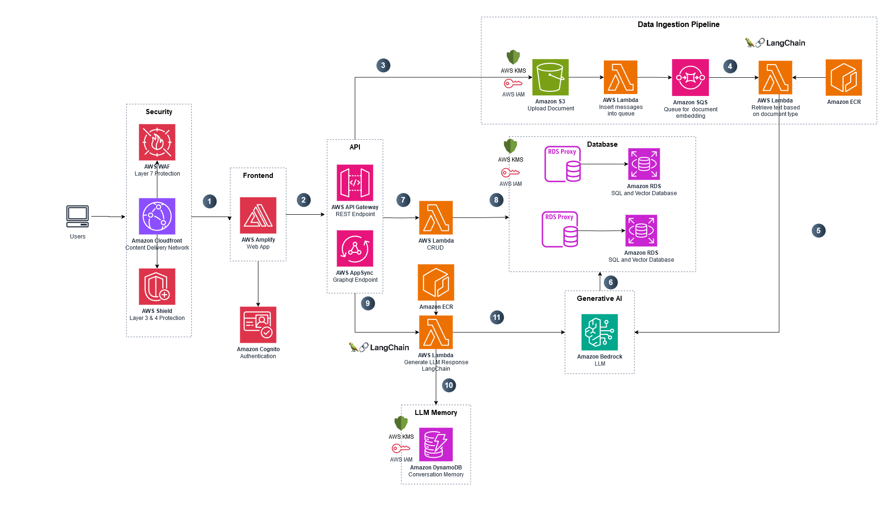

# Digital Strategy Assistant

This prototype explores how Large Language Models (LLMs) can enhance digital learning by providing an accessible and interactive way for the general public, educators, and administrators to engage with the Digital Strategy Assistant (DSA). Acting as a conversational guide, the chatbot allows users to ask questions and receive tailored responses aligned with DSA principles and recommendations. This approach fosters a broader understanding of technology-enhanced learning, making digital literacy concepts and strategies more approachable and relevant across educational and public contexts.


| Index                                               | Description                                             |
| :-------------------------------------------------- | :------------------------------------------------------ |
| [High Level Architecture](#high-level-architecture) | High level overview illustrating component interactions |
| [Deployment](#deployment-guide)                     | How to deploy the project                               |
| [User Guide](#user-guide)                           | The working solution                                    |
| [Directories](#directories)                         | General project directory structure                     |
| [API Documentation](#api-documentation)             | Documentation on the API the project uses               |
| [Changelog](#changelog)                             | Any changes post publish                                |
| [Credits](#credits)                                 | Meet the team behind the solution                       |
| [License](#license)                                 | License details                                         |

## High-Level Architecture

The following architecture diagram illustrates the various AWS components utilized to deliver the solution. For an in-depth explanation of the frontend and backend stacks, please look at the [Architecture Guide](docs/architectureDeepDive.md).



## Deployment Guide

To deploy this solution, please follow the steps laid out in the [Deployment Guide](./docs/deploymentGuide.md)

## User Guide

Please refer to the [Web App User Guide](./docs/userGuide.md) for instructions on navigating the web app interface.

## Directories

```
├── cdk
│   ├── bin
│   ├── data_ingestion
│   ├── lambda
│   ├── layers
│   ├── lib
│   └── text_generation
├── docs
├── frontend
│   ├── public
│   └── src
│       ├── app
│       └── components
│           ├── chat
│           ├── home
│           └── ui
└── frontendAdmin
    ├── public
    └── src
        ├── app
        └── components
            ├── analytics
            ├── auth
            ├── categories
            ├── files
            ├── history
            ├── prompt
            └── ui


```

1. `/cdk`: Contains the deployment code for the app's AWS infrastructure
   - `/bin`: Contains the instantiation of CDK stack
   - `/data_ingestion`: Contains the code required for the Data Ingestion step in retrieval-augmented generation. This folder is used by a Lambda function that runs a container which updates the vectorstore for a course when files are uploaded or deleted.
   - `/lambda`: Contains the lambda functions for the project
   - `/layers`: Contains the required layers for lambda functions
   - `/lib`: Contains the deployment code for all infrastructure stacks
   - `/text_generation`: Contains the code required for the Text Generation step in retrieval-augmented generation. This folder is used by a Lambda function that runs a container which retrieves specific documents and invokes the LLM to generate appropriate responses during a conversation.
2. `/docs`: Contains documentation for the application
3. `/frontend`: Contains the user interface of the general public application
   - `/public`: public assets used in the application
   - `/src`: contains the frontend code of the application
     - `/app`: Nextjs App Router
     - `/components`: Contains components used in the application
       - `/chat`: Contains chat components used in the application
       - `/home`: Contains home components used in the application
       - `/ui`: Contains shadcn ui components used in the application
4. `/frontendAdmin`: Contains the user interface of the administrator application
   - `/public`: public assets used in the application
   - `/src`: contains the frontend code of the application
     - `/app`: Nextjs App Router
     - `/components`: Contains components used in the application
       - `/analytics`: Contains chat components used in the application
       - `/auth`: Contains auth components used in the application
       - `/categories`: Contains category components used in the application
       - `/files`: Contains file components used in the application
       - `/history`: Contains chat history components used in the application
       - `/prompt`: Contains prompt modification components used in the application
       - `/ui`: Contains shadcn ui components used in the application

## API Documentation

Here you can learn about the API the project uses: [API Documentation](./docs/api-documentation.pdf).

## Modification Guide

Steps to implement optional modifications such as changing the colours of the application can be found [here](./docs/modificationGuide.md)

## Changelog

N/A

## Credits

This application was architected and developed by [Kanish Khanna](https://www.linkedin.com/in/kanishkhanna/), [Sean Woo](https://www.linkedin.com/in/seanwoo4/), [Aurora Cheng](https://www.linkedin.com/in/aurora-cheng04/), [Harshinee Sriram](https://www.linkedin.com/in/harshineesriram/), and [Aman Prakash](https://www.linkedin.com/in/aman-prakash-aa48b421b/), with project assistance by [Amy Cao](https://www.linkedin.com/in/amy-c-2313121b1/). Thanks to the UBC Cloud Innovation Centre Technical and Project Management teams for their guidance and support.

## License

This project is distributed under the [MIT License](LICENSE).

Licenses of libraries and tools used by the system are listed below:

[PostgreSQL license](https://www.postgresql.org/about/licence/)

- For PostgreSQL and pgvector
- "a liberal Open Source license, similar to the BSD or MIT licenses."

[LLaMa 3 Community License Agreement](https://llama.meta.com/llama3/license/)

- For Llama 3 70B Instruct model
