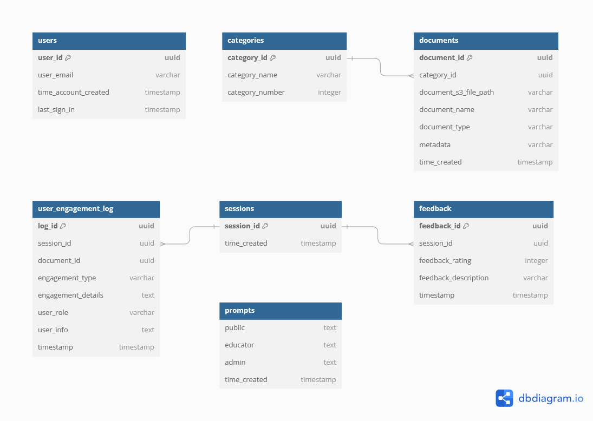

# Architecture Deep Dive

## Architecture


## Description
1. The user request is first sent through a security layer which comprises of AWS WAF, Amazon Cloudfront, and AWS Shield for flagging any potential threats.
2. The user request is then sent to the application hosted on AWS Amplify.
3. Amplify integrates with the backend API Gateway.
4. Admins can upload course materials to the application, which are stored in an S3 bucket using a pre-signed upload URL.
5. Adding a new DSA file to the S3 bucket triggers the data ingestion workflow. A message is sent to Amazon SQS which triggers the Lambda function. The Lambda function runs a Docker container with Amazon Elastic Container Registry (ECR) and embeds the text from uploaded files into vectors.This project uses the Amazon Titan Text Embeddings V2 model to generate embeddings.
6. A message is sent to Amazon SQS for using a Lambda function. Another Lambda function is triggered from the message in SQS which triggers the document evaluation in Amazon Bedrock.
7. The lambda function retrieves the vectors from PostgreSQL database.
8. The document evaluation is streamed to the frontend via AWS AppSync.
9. Admins can perform DSA management/access actions by sending an API request which invokes a lambda function.
10. This lambda function interacts with Amazon RDS.
11. Users can start chatting with the LLM by sending an API request that invokes the Lambda function to generate a response. The Lambda function runs a Docker container with Amazon ECR.
12. The lambda function stores the embedded messages in Amazon DynamoDB
13. This lambda function uses RAG architecture to retrieve the response from LLMs hosted on Amazon Bedrock augmented with the course's information stored in the Amazon RDS.
14. When an instructor clicks download chat logs, a lambda function is triggered to add the request to the SQS queue.
15. An AWS Lambda function is triggered by the SQS queue to process the chat messages asynchronously from Amazon Dynamodb.
16. The processed chat messages are then stored in the Amazon S3 database for structured storage and retrieval.
17. The Lambda function also interacts with AWS AppSync (GraphQL) to update the frontend chat interface in real-time, with notifications for when the CSV is finished downloading.
## Database Schema



### RDS Langchain Tables

### `langchain_pg_collection` table

| Column Name | Description                    |
| ----------- | ------------------------------ |
| `uuid`      | The uuid of the collection     |
| `name`      | The name of the collection     |
| `cmetadata` | The metadata of the collection |

### `langchain_pg_embedding` table

| Column Name     | Description                           |
| --------------- | ------------------------------------- |
| `id`            | The ID of the embeddings              |
| `collection_id` | The uuid of the collection            |
| `embedding`     | The vector embeddings of the document |
| `cmetadata`     | The metadata of the collection        |
| `document`      | The content of the document           |

### RDS PostgreSQL Tables

### `users` table

| Column Name            | Description                             |
| ---------------------- | --------------------------------------- |
| `user_id`              | The ID of the user                      |
| `user_email`           | The email of the user                   |
| `time_account_created` | The time the account was created        |
| `last_sign_in`         | The time the user last signed in        |

### `prompts` table

| Column Name            | Description                             |
| ---------------------- | --------------------------------------- |
| `public`              | The current and previous prompts for the general public                       |
| `educator`           | The current and previous prompts for educators                 |
| `admin`           | The current and previous prompts for admins             |
| `time_created`            | The time the prompt was created              |

### `categories` table

| Column Name     | Description                      |
| --------------- | -------------------------------- |
| `category_id`   | The ID of the category           |
| `category_name` | The name of the category         |
| `category_number` | The order number of the category |

### `sessions` table

| Column Name     | Description                           |
| --------------- | ------------------------------------- |
| `session_id`    | The ID of the session                 |
| `time_created`  | The timestamp when the session was created |

### `documents` table

| Column Name           | Description                                |
| --------------------- | ------------------------------------------ |
| `document_id`         | The ID of the document                     |
| `category_id`         | The ID of the associated category          |
| `document_s3_file_path` | The S3 file path where the document is stored |
| `document_name`       | The name of the document                   |
| `document_type`       | The type of the document (e.g. PDF, DOCX) |
| `meta_data`           | Additional metadata about the document     |
| `time_created`        | The timestamp when the document was created |

### `user_engagement_log` table

| Column Name        | Description                                  |
| ------------------ | -------------------------------------------- |
| `log_id`           | The ID of the engagement log entry           |
| `session_id`       | The ID of the associated session             |
| `document_id`      | The ID of the associated document            |
| `engagement_type`  | The type of engagement (e.g., document view) |
| `engagement_details` | Additional details about the engagement     |
| `user_role`        | The role of the user: one of public, educator, and admin                  |
| `user_info`        | Salted information about the user                   |
| `timestamp`        | The timestamp of the engagement              |

### `feedback` table

| Column Name           | Description                                   |
| --------------------- | --------------------------------------------- |
| `feedback_id`         | The ID of the feedback entry                  |
| `session_id`          | The ID of the associated session              |
| `feedback_rating`     | The rating provided in the feedback (1-5) |
| `feedback_description` | The description of the feedback              |
| `timestamp`        | The time the feedback was created           |

### `conversation_csv` table

| Column Name           | Description                                   |
| --------------------- | --------------------------------------------- |
| `session_id`          | The ID of the associated session              |
| `notified`          | The status of the notification (true/false)     |
| `timestamp`        | The time the feedback was created           |


## S3 Structure

```
.
├── {category_id_1}
│   ├── document1.pdf
│   └── document2.pdf
└── {category_id_2}
    ├── document1.pdf
    └── document2.pdf

.
├── {session_id_1}
│   ├── chathistory.csv
└── {session_id_2}
    ├── chathistory.csv
    
```
