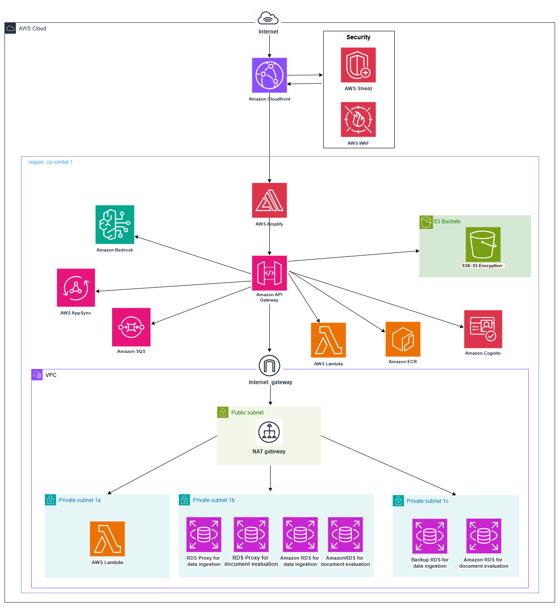

# Security Documentation & Network Architecture  

## Shared Responsibility Model 

#### The AWS Shared Responsibility Model defines the division of security responsibilities between CIC and its sponsors. At CIC, we are responsible for securing the cloud, while customers are responsible for securing their applications and data within the cloud

### CIC Responsibilities (Security of the Cloud):
- Infrastructure Security
- Network Protection 
- Compliance with Industry Security Standards
- Service-Level Security

### Customer Responsibilities (Security in the Cloud):
- Data Protection
- Identity & Access Management
- Application Security
- Network Security Configuration

[Learn more](https://aws.amazon.com/compliance/shared-responsibility-model/)

This document outlines the existing network and security configurations implemented for this project. Additionally, it provides recommendations and guidance on leveraging AWS services and features to enhance security, monitor application performance, and maintain compliance 

## 1. Network Architecture

