# User Guide

**Please ensure the application is deployed, instructions in the deployment guide here:**
- [Deployment Guide](./deploymentGuide.md)

Once you have deployed the solution, the following user guide will help you navigate the functions available.

| Index    | Description |
| -------- | ------- |
| [Administrator View](#admin-view)  | How administrators view the project | 
| [Public View](#public-view)  | How the general public views the project |

## Administrator View
Administrators can sign up by pressing the sign up button and filling in their information.
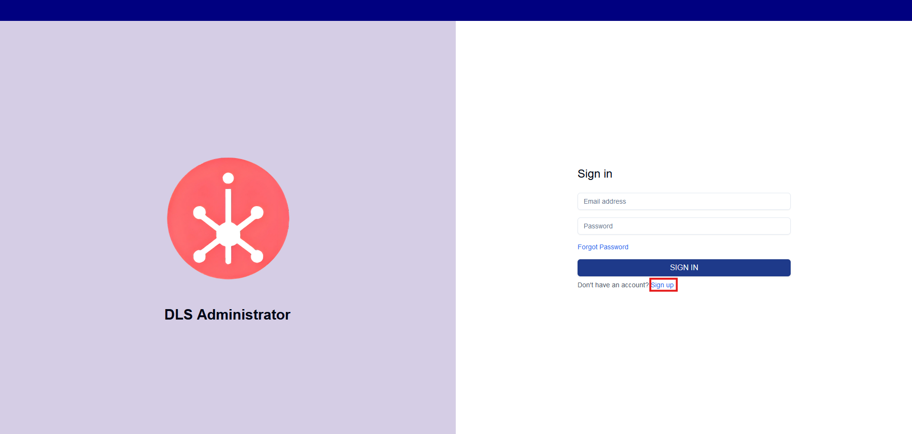
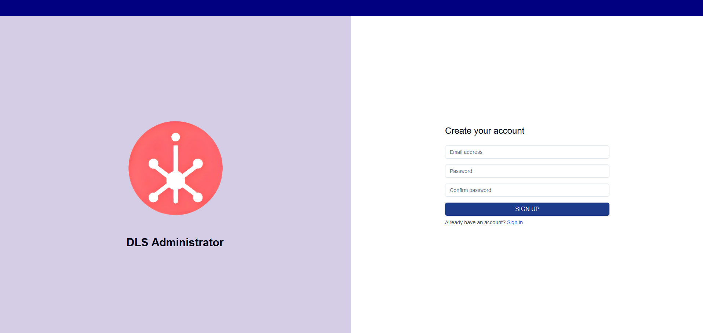

Approve administrators by changing their user group with Cognito through the AWS Console: 
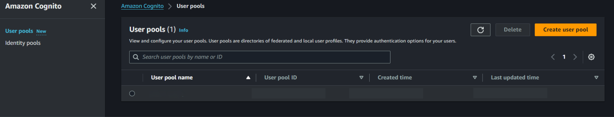

After clicking the user pool of the project, find the emails of the administrators to be approved:

After clicking their email, add the 'admin' user group:
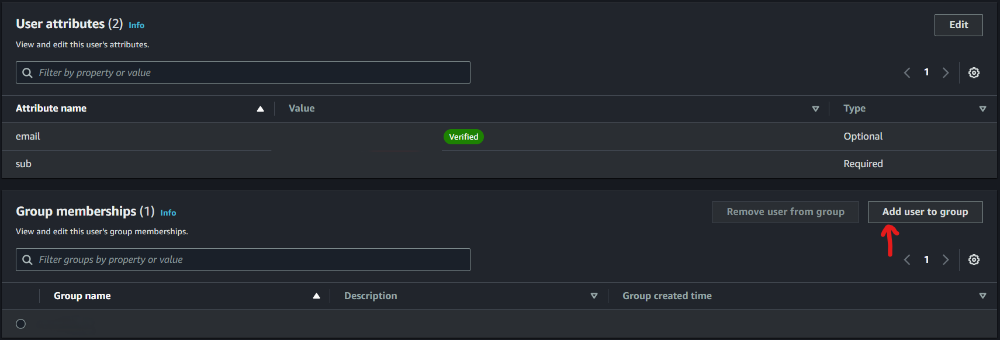
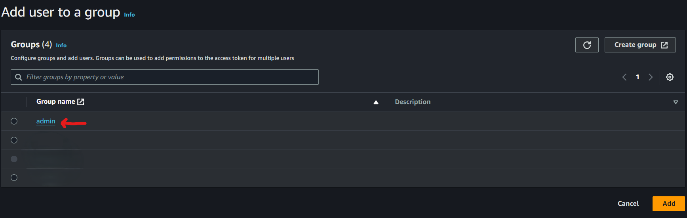

After inputting the confirmation code sent to their email, administrators can log in.
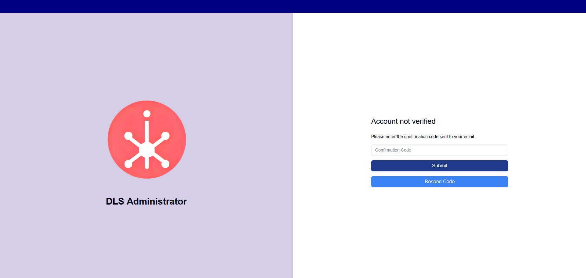

Upon logging in, the administrator will see the analytics of the public view of the Digital Strategy Assistant. This includes the number of users by month, the number of messages sent by each role by month, and the average feedback score for each role.
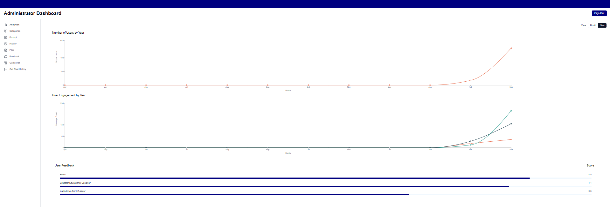

Clicking on the "Categories" button on the side bar will allow administrators to see the created categories. The entries can be reordered by dragging and dropping the move cell. Pressing save order will save the order of the categories.
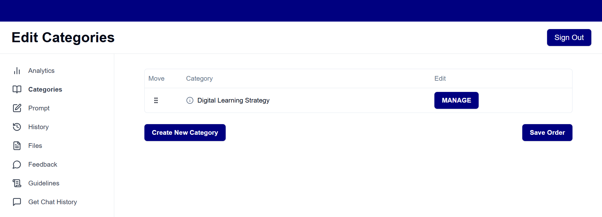

Clicking on the "MANAGE" button on an entry will open a page which allows the administrator to edit the category name, the files in the category and the descriptions of the files in the category. A category can be deleted by pressing "Delete Category". The changes to the category will be saved upon pressing "Save". Pressing Cancel will reopen the categories page. The files can be downloaded by pressing the download icon in each file. Pressing the "Create New Category" button on the categories page will bring the user to a similar page.
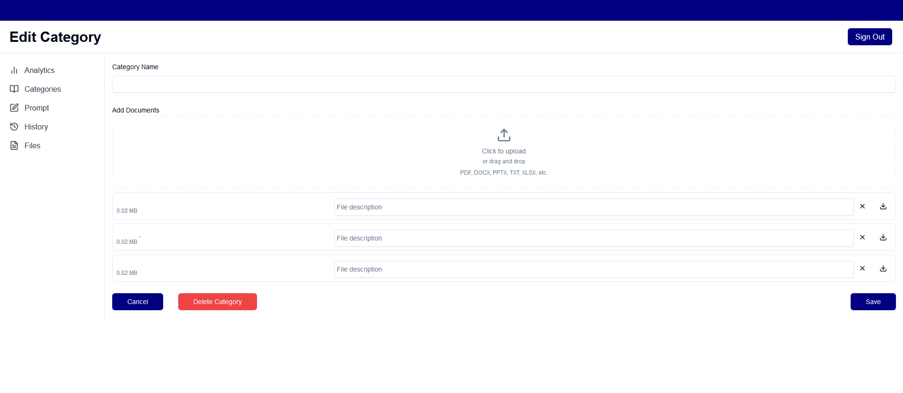

After clicking the "Prompt" button on the sidebar, administrators can edit the prompt and view previous prompts for each of the 3 user roles by clicking on the tabs. Clicking "Save" wll save the modifications to the current prompt for the selected user role.
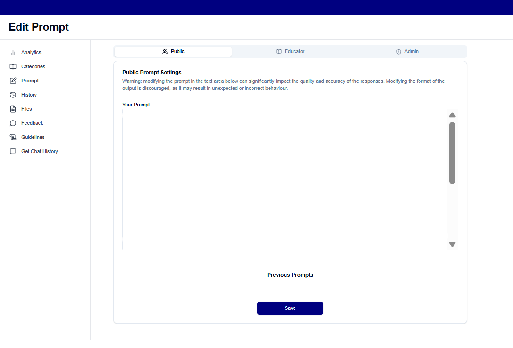

After clicking the "History" button on the sidebar, administrators can view the different sessions that users have created in the public view of the app. Clicking on a user role will open/collapse the sessions that are a part of that user role.
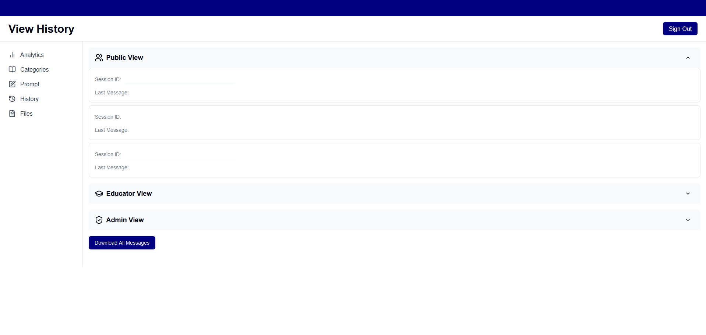

Clicking on a session from the history page will open the conversation history for that session. The administrator can view the user role, session id, average feedback rating, and feedback descriptions of the session as well.
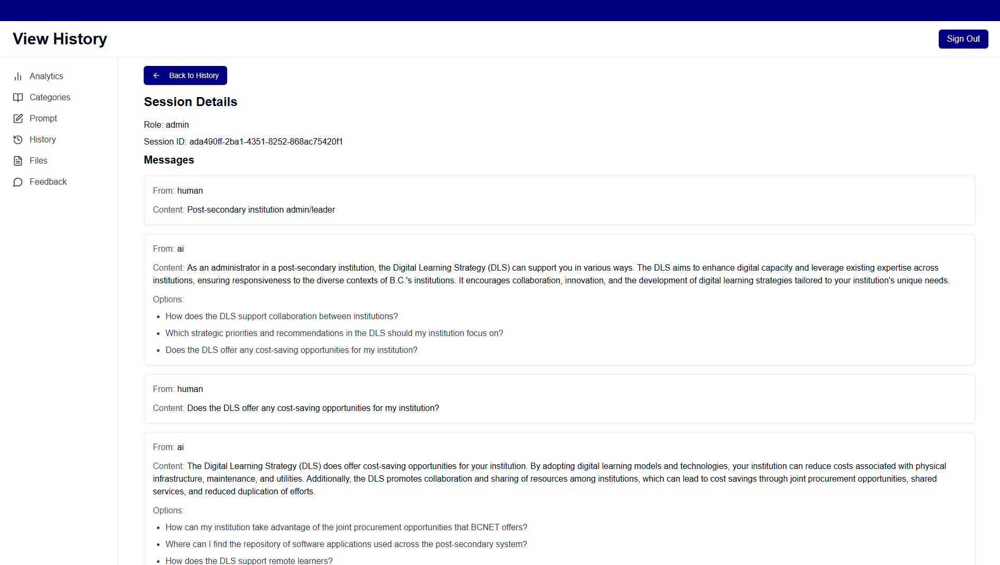

Clicking the "Files" button on the sidebar will allow the administrator to view all the files in every category as well as their descriptions. These are the files that the assistant will use to retrieve information. The files can be downloaded by pressing the download icon in each file.
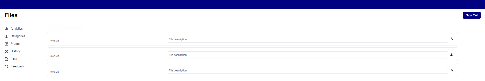

Clicking the "Feedback" button on the sidebar will allow the administrator to view all the feedbacks in every user role as well as their descriptions.
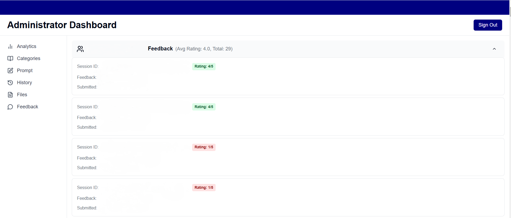

## Public View
Upon opening the public view of the app, users are greeted with a home page. Clicking on "About" or "T&C" will open a modal which either describes the DSA or shows the terms and conditions of using the assistant.
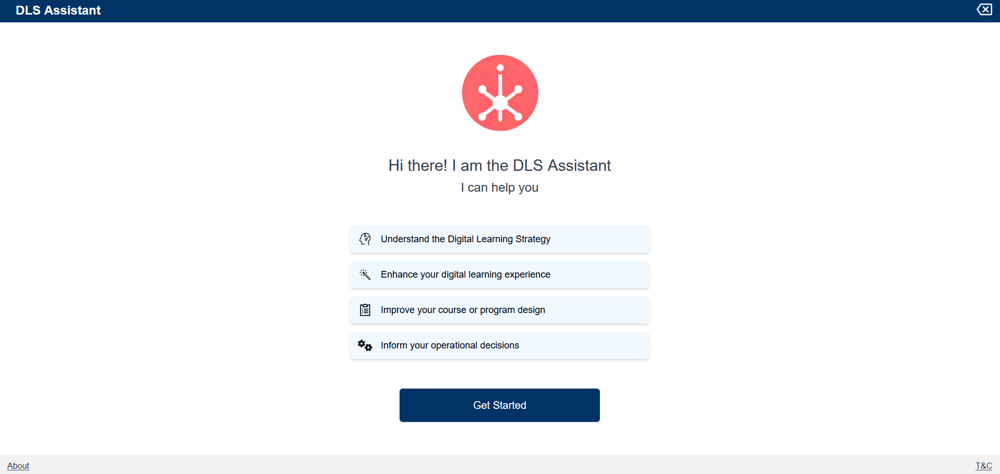

After clicking Get Started, the assistant will initiate the conversation by prompting the user to select their role. Users can click one of the 3 options to select their role.
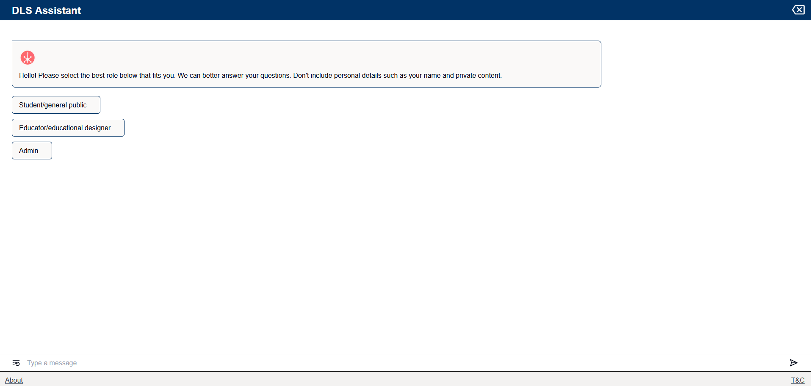

Users can then type their question to the assistant, or click on a recommended question to ask to the assistant. Pressing the send icon or the enter key will send the users question to the assistant. Pressing the refresh button will create a new session and restart the conversation with the assistant.
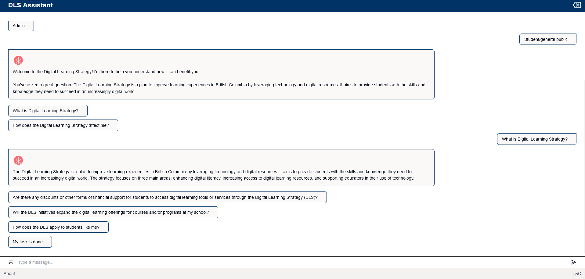

Clicking "My task is done" will open a feedback message where users can rate the assistant from 1 star to 5 stars and provide additional feedback. Clicking "Send Feedback" will complete the feedback process.
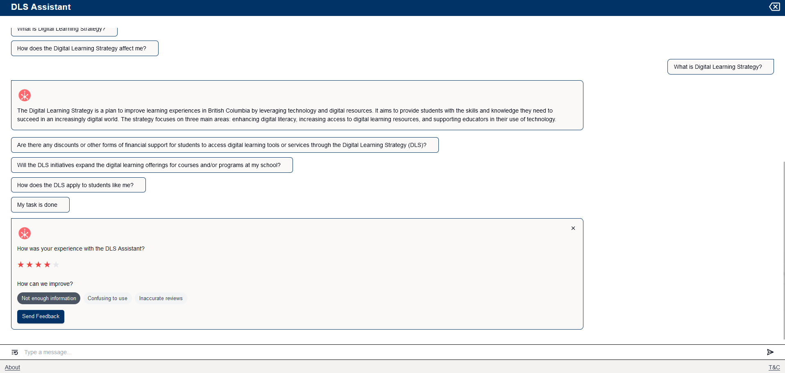
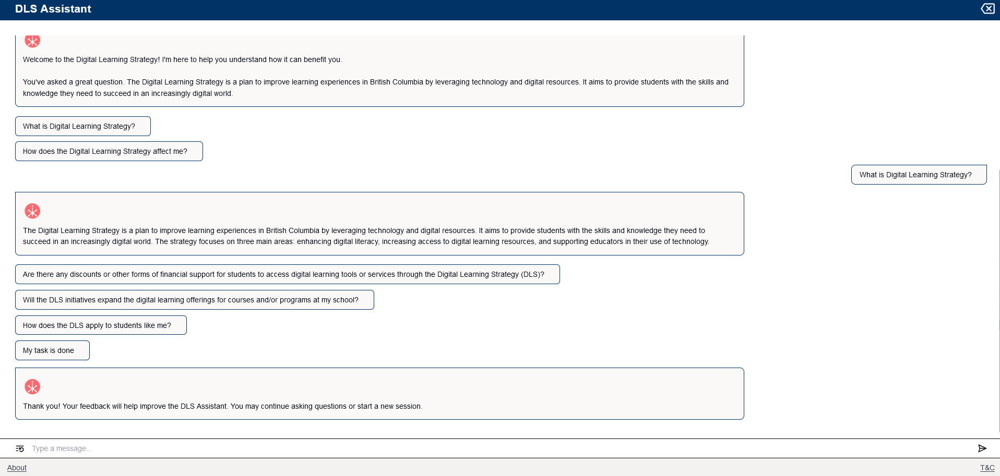